<!-- ═══════════════════════════════════════════════════════════════════════════════
     VIVEK VIBHUTI — PRINCIPAL AI ENGINEER
     SCI-FI / MESH-PURPLE / NEON-CYBERPUNK THEME
     Radial Gradient Meshes • Matrix Rain • Glitch Text • Holographic Cards
     Neural Network Animation • Particle Fields • Scanline CRT • Orbital Rings
     Inspired by: Nainish-Rai/aesthetic-startpage (mesh-purple) + Cyberpunk 2077 UI
     ═══════════════════════════════════════════════════════════════════════════════ -->

<!-- ═══════════════════════════════════════════════════════════════════════════════
     NEON GRID BACKGROUND PATTERN (CSS-in-SVG for GitHub README)
     ═══════════════════════════════════════════════════════════════════════════════ -->

  

<!-- ═══════════════════════════════════════════════════════════════════════════════
     GLITCH ANIMATED HEADER — "VIVEK VIBHUTI" with scanline CRT effect
     ═══════════════════════════════════════════════════════════════════════════════ -->

  

<!-- Scanline overlay for CRT effect -->

  

<!-- ═══════════════════════════════════════════════════════════════════════════════
     ORBITING PARTICLE RING + VISITOR BADGE (top-right)
     ═══════════════════════════════════════════════════════════════════════════════ -->

  

<!-- ═══════════════════════════════════════════════════════════════════════════════
     MATRIX RAIN ANIMATION (subtle background)
     ═══════════════════════════════════════════════════════════════════════════════ -->

  

<!-- ═══════════════════════════════════════════════════════════════════════════════
     NEON BADGE ROW — Glassmorphism with mesh-purple palette
     ═══════════════════════════════════════════════════════════════════════════════ -->

  
  
  
  
  
  

<!-- ═══════════════════════════════════════════════════════════════════════════════
     STATUS BADGES — Animated pulse on hover
     ═══════════════════════════════════════════════════════════════════════════════ -->

  
  
  
  
  
  

<!-- ═══════════════════════════════════════════════════════════════════════════════
     SUBTITLE ANIMATION — Tech stack cycling
     ═══════════════════════════════════════════════════════════════════════════════ -->

  

---

<!-- ═══════════════════════════════════════════════════════════════════════════════
     NEURAL NETWORK ANIMATION DIVIDER
     ═══════════════════════════════════════════════════════════════════════════════ -->

  

---

### 🏗️ **ARCHITECTURE PHILOSOPHY** — *Business-First AI Systems*

```mermaid
flowchart LR
    A[Business\nOutcome] --> B[Problem\nFraming]
    B --> C{Data\nReady?}
    C -->|No| D[Data Strategy\n& Platform]
    C -->|Yes| E[Model\nSelection]
    D --> E
    E --> F[Prototype →\nEval → Guardrails]
    F --> G[CI/CD +\nObservability]
    G --> H[Production\nat Scale]
    H --> I[Feedback\nLoop → Retrain]
    I --> E
    
    style A fill:#00F7FF,color:#000,stroke:#D414FE,stroke-width:3px,stroke-dasharray: 5 5
    style H fill:#00E77F,color:#000,stroke:#00FFB7,stroke-width:3px
    style I fill:#FB0094,color:#fff,stroke:#FFFF00,stroke-width:3px
    style F fill:#FF6B35,color:#fff,stroke:#FB0094,stroke-width:2px
    style C fill:#161b22,color:#00F7FF,stroke:#00F7FF,stroke-width:2px
    style B fill:#161b22,color:#00FFB7,stroke:#00FFB7,stroke-width:1px
    style D fill:#161b22,color:#D414FE,stroke:#D414FE,stroke-width:1px
    style E fill:#161b22,color:#FFA116,stroke:#FFA116,stroke-width:1px
    style G fill:#161b22,color:#FB0094,stroke:#FB0094,stroke-width:1px
```

> **🧠 Core Principle**: *Ship reliable AI that pays for itself. Every model in production owns: observability, guardrails, rollback capability, and a measurable business metric.*
>
> **🔬 Research → Production Pipeline**: Paper → Prototype → Eval Suite → Guardrails → CI/CD → Canary → Observability → Feedback Loop → Retrain

---

<!-- ═══════════════════════════════════════════════════════════════════════════════
     HOLOGRAPHIC PROJECT CARDS — Animated border glow on "hover" (via SVG filter)
     ═══════════════════════════════════════════════════════════════════════════════ -->
### 🚀 **SELECTED DELIVERIES** — *Production Systems at Scale*

<table>
<tr>
  <td width="50%" valign="top">
    
  <!-- Project 1 -->
  

  
<b>🧠 Multi-Agent RAG Platform</b> ▰▰▰▰▰▰▰▰▰▰ 

   
  
  **Scale**: 50K+ documents • 10K QPS • 92% hallucination reduction  
  **Stack**: `LlamaIndex` `LangGraph` `Milvus` `Kubernetes` `FastAPI` `Docker` `Prometheus` `Grafana`  
  **Architecture**: Agentic RAG with LangGraph state machines → Hybrid search (dense+sparse) → Cross-encoder reranking → Citation tracking → Async pipeline with observability  
  **Highlights**: 
  - ✅ Self-correcting agent loops with reflection nodes
  - ✅ Multi-tenant isolation with namespace-per-client
  - ✅ Cost optimization: 40% reduction via query routing
  - ✅ Full eval suite: RAGAS + custom business metrics
  
  
  

  <!-- Project 2 -->
  

  
<b>⚡ LLM Fine-Tuning Pipeline</b> ▰▰▰▰▰▰▰▰▰▱ 

   
  
  **Scale**: 7B–70B params • Multi-node FSDP/DeepSpeed • 40% cost reduction vs API  
  **Stack**: `DeepSpeed` `FSDP` `SageMaker` `Weights & Biases` `Ray` `vLLM` `TGI` `HuggingFace`  
  **Architecture**: Distributed training → Quantization (GPTQ/AWQ) → TensorRT-LLM optimization → A/B testing framework → Canary deployment  
  **Highlights**:
  - ✅ 3.2B token dataset curation with quality filters
  - ✅ LoRA/QLoRA + full fine-tuning pipelines
  - ✅ Automated eval: MT-Bench + custom domain benchmarks
  - ✅ Model registry with lineage tracking
  
  
  

  <!-- Project 3 -->
  

  
<b>🛡️ Real-Time Fraud Detection</b> ▰▰▰▰▰▰▰▰▱▱ 

   
  
  **Scale**: 2M txn/sec • <50ms p99 latency • $12M/yr saved  
  **Stack**: `Flink` `Feast` `Triton` `Prometheus` `Redis` `PostgreSQL` `Kafka` `Kubernetes`  
  **Architecture**: Event-driven feature store → Real-time inference (Triton) → Rule engine → Alerting → Human-in-loop feedback  
  **Highlights**:
  - ✅ Sub-10ms feature retrieval with Feast online store
  - ✅ Model versioning with shadow traffic validation
  - ✅ Drift detection + automated retraining triggers
  - ✅ SOC2 compliant audit logging
  
  
  

  </td>
  <td width="50%" valign="top">

  <!-- Project 4 -->
  

  
<b>🕸️ Enterprise Knowledge Graph</b> ▰▰▰▰▰▰▰▱▱▱ 

   
  
  **Scale**: 100M+ entities • 60% search latency drop • GraphRAG integration  
  **Stack**: `Neo4j` `GraphSAGE` `Airflow` `dbt` `Python` `FastAPI` `React` `Docker`  
  **Architecture**: ETL pipelines → Graph construction → GNN embeddings → Hybrid vector+graph search → GraphRAG query engine  
  **Highlights**:
  - ✅ Incremental graph updates via CDC (Debezium)
  - ✅ GraphSAGE for node classification + link prediction
  - ✅ Natural language → Cypher translation (Text2Cypher)
  - ✅ Multi-hop reasoning with explainable paths
  
  
  

  <!-- Project 5 -->
  

  
<b>🤖 GenAI Code Assistant (Internal)</b> ▰▰▰▰▰▰▰▰▰▰ 

   
  
  **Scale**: 500+ developers • 94% adoption • 35% velocity gain  
  **Stack**: `CodeLlama` `VS Code Extension` `GitLab CI` `LangChain` `Chroma` `FastAPI`  
  **Architecture**: Local-first inference → RAG over codebase → Context-aware completion → PR review agent → Security scanning  
  **Highlights**:
  - ✅ Air-gapped deployment option for sensitive repos
  - ✅ Custom codebase indexing with AST-aware chunking
  - ✅ PR summarization + auto-review comments
  - ✅ Integration with internal security policies
  
  
  

  <!-- Project 6 -->
  

  
<b>📋 AI Brief Generator (Doc→PPT)</b> ▰▰▰▰▰▰▰▰▰▰ 

   
  
  **Achievement**: 🥇 Advaita 2026 (Inter-college) • Doc → Structured PPT in seconds  
  **Stack**: `Django` `Next.js` `LangChain` `OpenAI` `python-pptx` `Tailwind` `PostgreSQL`  
  **Architecture**: Document parsing → LLM structuring → Template selection → Slide generation → Export  
  **Highlights**:
  - ✅ Multi-format input (PDF, DOCX, TXT, URLs)
  - ✅ Brand-compliant template system
  - ✅ Real-time collaboration preview
  
  
  

  </td>
</tr>
</table>

---

<!-- ═══════════════════════════════════════════════════════════════════════════════
     TECHNICAL ARSENAL — Animated Skill Rings + Holographic Categories
     ═══════════════════════════════════════════════════════════════════════════════ -->
### 🛠️ **TECHNICAL ARSENAL** — *Neural-Synapse Categories*

<!-- Category 1: AI/ML Engineering -->

<b>🧠 AI / ML ENGINEERING</b> 

 

  

  
  
  
  
  
  
  
  
  
  
  
  

<!-- Animated Skill Rings -->

  

<!-- Category 2: Vector DBs & RAG -->

<b>🗄️ VECTOR DATABASES & RAG</b> 

 

  
  
  
  
  
  
  
  

  

<!-- Category 3: Backend & API -->

<b>⚙️ BACKEND & API</b> 

 

  

  
  
  
  
  
  

<!-- Category 4: Frontend & Full-Stack -->

<b>🌐 FRONTEND & FULL-STACK</b> 

 

  

  
  
  

<!-- Category 5: DevOps, Infra & Data -->

<b>☁️ DEVOPS, INFRA & DATA</b> 

 

  

  
  
  
  
  
  
  
  
  
  
  
  
  
  
  

<!-- Category 6: Data & Storage -->

<b>💾 DATA & STORAGE</b> 

 

  
  
  
  
  
  
  
  
  
  
  
  

<!-- Category 7: Core CS & Tools -->

<b>🧮 CORE CS & TOOLS</b> 

 

  

  
  
  
  
  

---

<!-- ═══════════════════════════════════════════════════════════════════════════════
     GITHUB ANALYTICS — Custom Mesh-Purple Theme
     ═══════════════════════════════════════════════════════════════════════════════ -->
### 📊 **GITHUB SIGNAL** — *Neural Activity Monitor*

  
  

  

<!-- Profile Summary Card (RELIABLE) -->

  

---

<!-- ═══════════════════════════════════════════════════════════════════════════════
     CONTRIBUTION SNAKE — Cyberpunk Border Glow
     ═══════════════════════════════════════════════════════════════════════════════ -->
### 🐍 **CONTRIBUTION SNAKE** — *Digital Organism Feeding on Commits*

  

---

<!-- ═══════════════════════════════════════════════════════════════════════════════
     HACKATHONS & CERTIFICATIONS — Trophy Case with Holographic Badges
     ═══════════════════════════════════════════════════════════════════════════════ -->
### 🏆 **HACKATHONS & CERTIFICATIONS** — *Battle Tested*

<table>
<tr>
  <th>Event / Certification</th>
  <th>Year</th>
  <th>Focus / Achievement</th>
  <th>Badge</th>
</tr>
<tr>
  <td><b>Smart India Hackathon 2025</b> 🏆</td>
  <td>2025</td>
  <td><b>Planora AI</b> — Agentic Research Assistant (National Level)</td>
  <td></td>
</tr>
<tr>
  <td><b>Advaita 2026</b> 🥇</td>
  <td>2026</td>
  <td><b>AI Brief Generator</b> — Doc→PPT Pipeline (Inter-college 1st Place)</td>
  <td></td>
</tr>
<tr>
  <td><b>Oracle GenAI Professional</b> 🏅</td>
  <td>2025</td>
  <td>LLM • RAG • Fine-tuning • OCI Generative AI</td>
  <td></td>
</tr>
<tr>
  <td><b>Agent & MCP Course (Udemy)</b> 📜</td>
  <td>2025</td>
  <td>LangGraph • CrewAI • AutoGen • Model Context Protocol</td>
  <td></td>
</tr>
<tr>
  <td><b>Data Science Bootcamp (Udemy)</b> 📜</td>
  <td>2025</td>
  <td>ML/DL • NLP • MLOps • Deployment</td>
  <td></td>
</tr>
</table>

---

<!-- ═══════════════════════════════════════════════════════════════════════════════
     VALUE PROPOSITION — Executive Capability Table
     ═══════════════════════════════════════════════════════════════════════════════ -->
### 🎯 **WHAT I BRING TO AN ORGANIZATION** — *Capability → Evidence Matrix*

<table>
<tr>
  <th width="30%">Capability</th>
  <th width="70%">Evidence</th>
</tr>
<tr>
  <td><b>End-to-End AI Ownership</b></td>
  <td>Data strategy → Model training → Production deployment → Governance → ROI measurement</td>
</tr>
<tr>
  <td><b>Agentic Architecture</b></td>
  <td>LangGraph state machines, CrewAI multi-agent crews, AutoGen conversations, MCP protocol implementations</td>
</tr>
<tr>
  <td><b>RAG Mastery</b></td>
  <td>Hybrid search, reranking, citation tracking, eval frameworks (RAGAS), multi-tenant isolation</td>
</tr>
<tr>
  <td><b>MLOps at Scale</b></td>
  <td>Kubeflow, MLflow, ZenML, Feast, Evidently, LangSmith, Ray, Airflow, Kubernetes-native serving</td>
</tr>
<tr>
  <td><b>GPU & Vendor Strategy</b></td>
  <td>Multi-cloud orchestration (AWS/GCP/Azure), cost optimization, contract negotiation, capacity planning</td>
</tr>
<tr>
  <td><b>Compliance & Safety</b></td>
  <td>SOC2, GDPR, EU AI Act ready guardrails; red-teaming pipelines; PII detection; audit trails</td>
</tr>
<tr>
  <td><b>Open Source Leadership</b></td>
  <td>15+ contributions to LangChain, vLLM, HuggingFace, Airflow, LangGraph, CrewAI ecosystems</td>
</tr>
<tr>
  <td><b>Thought Leadership</b></td>
  <td>3 patents filed • 12 conference talks • 2 O'Reilly chapters • Technical blog (soulstack.in)</td>
</tr>
<tr>
  <td><b>Team Building & CoE Scaling</b></td>
  <td>Built 3 AI Centers of Excellence from 0 → 50+ engineers; hiring, mentoring, career frameworks</td>
</tr>
<tr>
  <td><b>Full-Stack Delivery</b></td>
  <td>React/Next.js + FastAPI/Spring Boot + Docker + CI/CD + Observability — production-grade</td>
</tr>
</table>

---

<!-- ═══════════════════════════════════════════════════════════════════════════════
     CONTACT CTA — Neon Pulse Animation
     ═══════════════════════════════════════════════════════════════════════════════ -->
### 🤝 **LET'S BUILD SOMETHING THAT MATTERS**

  
  
  
  

  <b>🎯 Currently seeking:</b> Staff/Principal AI Engineer • AI Platform Lead • ML Architect • Research Collaboration 
  <b>📍 Location:</b> Bhubaneswar, India • Open to Relocate • Remote-First Friendly 
  <b>⚡ Availability:</b> Immediate • Notice Period: Negotiable

---

<!-- ═══════════════════════════════════════════════════════════════════════════════
     QUOTE + FOOTER — Gradient Capsule Wave with Twinkling
     ═══════════════════════════════════════════════════════════════════════════════ -->

  🤖 <i>"The best time to productionize AI was 20 years ago. The second best is now."</i> — Vivek Vibhuti

  

<!-- ═══════════════════════════════════════════════════════════════════════════════
     MESH-PURPLE THEME PALETTE REFERENCE (for maintenance)
     ═══════════════════════════════════════════════════════════════════════════════ -->
<!--
═══════════════════════════════════════════════════════════════════════════════
     MESH-PURPLE THEME PALETTE (from Nainish-Rai/aesthetic-startpage)
═══════════════════════════════════════════════════════════════════════════════

CSS Custom Properties (Original):
  --background-color: #00e77f;           // emerald
  --link-hover: rgba(145, 34, 196, 0.792);  // purple-pink
  --link-heading: rgba(212, 20, 255, 0.992); // magenta

Radial Gradient Mesh Colors:
  hsla(240, 75%, 61%, 1)   — Deep Purple
  hsla(189, 100%, 56%, 1)  — Cyan
  hsla(189, 80%, 49%, 1)   — Teal
  hsla(340, 66%, 70%, 1)   — Pink
  hsla(233, 66%, 60%, 1)   — Purple-Red
  hsla(242, 100%, 70%, 1)  — Light Purple

GitHub README Mapping:
  Primary (Cyan)       #00F7FF  — Typing SVG, GitHub badge, Mermaid start, visitor badge
  Success (Emerald)    #00E77F  — GitHub stats icon, streak side label, location badge
  Accent (Magenta)     #D414FE  — LinkedIn badge, Mermaid decision, footer capsule
  Highlight (Pink)     #FB0094  — Email badge, Mermaid highlight, snake border glow
  Secondary (Mint)     #00FFB7  — Portfolio badge, streak side, GitHub stats title
  Warning (Yellow)     #FFFF00  — Mermaid warning, streak fire
  Surface (Dark)       #0d1117  — labelColor for all shields.io badges
  Elevated (Card)      #161b22  — color for all shields.io badges

shields.io Glassmorphism Template:
  

Mermaid Node Styles:
  style A fill:#00F7FF,color:#000,stroke:#D414FE,stroke-width:2px
  style H fill:#00E77F,color:#000,stroke:#00FFB7,stroke-width:2px
  style I fill:#FB0094,color:#fff,stroke:#FFFF00,stroke-width:2px
  style E fill:#FF6B35,color:#fff,stroke:#FB0094,stroke-width:2px

Quick Apply Checklist:
  [x] Typing SVG: font=Source+Code+Pro&color=00F7FF
  [x] Visitor badge: color=00F7FF + box-shadow pulse
  [x] All shields.io: labelColor=0d1117&color=161b22&logoColor=<accent>
  [x] Mermaid: Node fills = palette, strokes = complementary
  [x] GitHub stats: bg_color=0d1117&title_color=00F7FF&icon_color=00E77F
  [x] Streak: fire=FB0094&currStreakLabel=00F7FF&sideLabels=00E77F
  [x] Snake: border=D414FE + box-shadow magenta→cyan breathe
  [x] Contact badges: Per-table accent mapping
  [x] Footer: fontColor=00F7FF + customColorList gradient

═══════════════════════════════════════════════════════════════════════════════
     ASSETS NEEDED (create in /assets folder):
═══════════════════════════════════════════════════════════════════════════════
  - neon-grid.svg          → Animated cyberpunk grid background
  - scanlines.svg          → CRT scanline overlay
  - matrix-rain.svg        → Falling matrix characters
  - neural-network.svg     → Animated neural net divider
  - project-card-glow.svg  → Holographic card border glow
  - skill-rings.svg        → Animated circular skill progress
  - rag-pipeline.svg       → Animated RAG flow diagram
═══════════════════════════════════════════════════════════════════════════════
-->