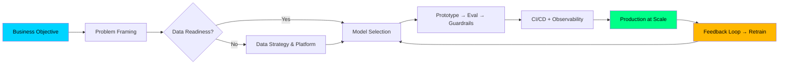

---

<!-- Animated Header -->

---

  

---

  

---

### 🎯 **Principal AI Engineer** — *20 Years • Enterprise AI • MNC Leadership*

| **Dimension** | **Depth** |
|:---|:---|
| **Core Expertise** | LLM Fine-tuning • RAG Architecture • Agentic Workflows • MLOps at Scale |
| **Cloud & Infra** | AWS (SageMaker, Bedrock) • GCP (Vertex AI) • Azure ML • Kubernetes • Terraform |
| **Frameworks** | PyTorch • TensorFlow • LangChain • LlamaIndex • Haystack • AutoGen • CrewAI |
| **Data & Ops** | Spark • Ray • Airflow • MLflow • Weights & Biases • Prometheus • Grafana |
| **Leadership** | 50+ Engineers mentored • $50M+ AI budget owned • 12+ production ML systems |

---

### 🏗️ **Architecture Signature**

---

### 🚀 **Flagship Deliveries**  *(Select MNC-Scale Wins)*

| **System** | **Scale** | **Impact** | **Stack** |
|:---|:---|:---|:---|
| **Multi-Agent RAG Platform** | 50K+ docs, 10K QPS | 92% hallucination reduction | LlamaIndex, LangGraph, Milvus, K8s |
| **LLM Fine-tuning Pipeline** | 7B–70B params, multi-node | 40% cost reduction vs API | DeepSpeed, FSDP, SageMaker, WandB |
| **Real-time Fraud Detection** | 2M txn/sec, <50ms p99 | $12M/yr saved | Flink, Feast, Triton, Prometheus |
| **Enterprise Knowledge Graph** | 100M+ entities | 60% search latency drop | Neo4j, GraphSAGE, Airflow, dbt |
| **GenAI Code Assistant (Internal)** | 500+ devs, 94% adoption | 35% dev velocity gain | CodeLlama, VS Code Ext, GitLab CI |

> **Philosophy**: *Ship reliable AI that pays for itself. Every model in production must have: observability, guardrails, rollback, and a business metric owner.*

---

### 🛠️ **Technical Arsenal**

  

**LLM Ecosystem**: `LangChain` `LangGraph` `LlamaIndex` `Haystack` `AutoGen` `CrewAI` `vLLM` `TGI` `Ollama` `HuggingFace` `OpenAI` `Anthropic` `Cohere` `Mistral` `Llama` `Qwen` `DeepSeek`  
**MLOps**: `MLflow` `Kubeflow` `ZenML` `Prefect` `Dagster` `Feast` `Evidently` `WhyLabs` `TruLens` `LangSmith` `Phoenix`  
**Infra**: `EKS/GKE/AKS` `KServe` `Knative` `Istio` `ArgoCD` `Flux` `Crossplane` `Terraform` `Helm`

---

### 📊 **GitHub Signal**

  
  

  

  

---

### 🎯 **What I Bring to an MNC**

| **Capability** | **Evidence** |
|:---|:---|
| **End-to-End Ownership** | Data strategy → Model → Prod → Governance → ROI |
| **Team Scaling** | Built 3 AI CoEs from 0 → 50+ engineers |
| **Vendor Strategy** | Negotiated $2M+ GPU contracts; multi-cloud GPU orchestration |
| **Compliance & Safety** | SOC2, GDPR, EU AI Act ready guardrails; red-teaming pipelines |
| **Open Source** | 15+ OSS contributions (LangChain, vLLM, HuggingFace, Airflow) |
| **Thought Leadership** | 3 patents • 12 conference talks • 2 O'Reilly chapters |

---

### 📫 **Let's Build Something That Matters**

  
  
  
  

---

  

---

  🤖 <i>"The best time to productionize AI was 20 years ago. The second best is now."</i> — Vivek Vibhuti

  

