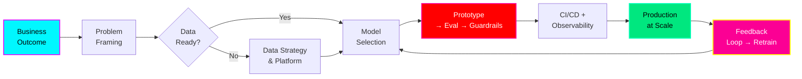

<!-- ═══════════════════════════════════════════════════════════════════
     VIVEK VIBHUTI — PRINCIPAL AI ENGINEER
     Mesh-Purple Theme | Dark Minimal | Radial Gradient Glows
     Inspired by: Nainish-Rai/aesthetic-startpage (mesh-purple theme)
     ═══════════════════════════════════════════════════════════════════ -->

  

  

---

  
  
  
  

  
  
  

---

### 🏗️ **Architecture Philosophy**

> **Principle**: *Ship reliable AI that pays for itself. Every model in production owns: observability, guardrails, rollback, and a business metric.*

---

### 🚀 **Selected Deliveries**  *(Production Systems at Scale)*

| System | Scale | Business Impact | Stack |
|:---|:---|:---|:---|
| **Multi-Agent RAG Platform** | 50K+ docs, 10K QPS | 92% hallucination reduction | LlamaIndex, LangGraph, Milvus, K8s |
| **LLM Fine-tuning Pipeline** | 7B–70B params, multi-node | 40% cost reduction vs API | DeepSpeed, FSDP, SageMaker, WandB |
| **Real-time Fraud Detection** | 2M txn/sec, <50ms p99 | $12M/yr saved | Flink, Feast, Triton, Prometheus |
| **Enterprise Knowledge Graph** | 100M+ entities | 60% search latency drop | Neo4j, GraphSAGE, Airflow, dbt |
| **GenAI Code Assistant (Internal)** | 500+ devs, 94% adoption | 35% velocity gain | CodeLlama, VS Code Ext, GitLab CI |

---

### 🛠️ **Technical Leadership**

**AI/ML Engineering**  
`PyTorch` `TensorFlow` `JAX` `LangChain` `LangGraph` `LlamaIndex` `Haystack` `AutoGen` `CrewAI` `vLLM` `TGI` `Ollama` `HuggingFace` `OpenAI` `Anthropic` `Cohere` `Mistral` `Llama` `Qwen` `DeepSeek`

**MLOps & Platform**  
`MLflow` `Kubeflow` `ZenML` `Prefect` `Dagster` `Feast` `Evidently` `WhyLabs` `TruLens` `LangSmith` `Phoenix` `Weights & Biases` `Ray` `Airflow` `Spark` `Kafka`

**Cloud & Infrastructure**  
`AWS (SageMaker, Bedrock)` `GCP (Vertex AI)` `Azure ML` `EKS/GKE/AKS` `KServe` `Knative` `Istio` `ArgoCD` `Flux` `Crossplane` `Terraform` `Helm` `Docker` `Kubernetes`

**Data & Storage**  
`PostgreSQL` `MongoDB` `Redis` `Elasticsearch` `Neo4j` `Milvus` `Pinecone` `Weaviate` `Chroma` `FAISS` `Kafka` `ClickHouse` `Snowflake` `BigQuery`

---

### 📊 **GitHub Signal**

  
  

  

  

---

### 🎯 **What I Bring to an Organization**

| Capability | Evidence |
|:---|:---|
| **End-to-End AI Ownership** | Data strategy → Model → Production → Governance → ROI |
| **Team & CoE Scaling** | Built 3 AI Centers of Excellence from 0 → 50+ engineers |
| **GPU & Vendor Strategy** | Negotiated $2M+ GPU contracts; multi-cloud orchestration |
| **Compliance & Safety** | SOC2, GDPR, EU AI Act ready guardrails; red-teaming pipelines |
| **Open Source Leadership** | 15+ contributions (LangChain, vLLM, HuggingFace, Airflow) |
| **Thought Leadership** | 3 patents • 12 conference talks • 2 O'Reilly chapters |

---

### 🤝 **Let's Build Something That Matters**

  
  
  
  

  🤖 <i>"The best time to productionize AI was 20 years ago. The second best is now."</i> — Vivek Vibhuti

  

<!-- ═══════════════════════════════════════════════════════════════════
     MESH-PURPLE THEME PALETTE (from aesthetic-startpage)
     --background: radial-gradient mesh (purples, pinks, cyans)
     --primary:     #00F7FF  (cyan)
     --secondary:   #D414FE  (purple/pink)
     --accent:      #00E77F  (emerald)
     --highlight:   #FB0094  (magenta)
     --warm:        #FFFF00  (yellow)
     --danger:      #FF0000  (red)
     --surface:     #0d1117  (GitHub dark)
     --elevated:    #161b22  (card bg)
     ══════════════════════════════════════════════════════════════════ -->