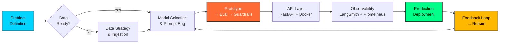

---

<!-- =====================================================================
 *  VIVEK VIBHUTI — AI ENGINEER PROFILE
 *  Advanced Aesthetic GitHub README
 *  Built with: Dynamic SVG, Mermaid, Shields.io, GitHub Actions
 *  Last Updated: Auto-synced via workflow
 *===================================================================-->

<!-- ═══════════════════════════════════════════════════════════════════
     ANIMATED TYPING HEADER — JetBrains Mono, Cyan Gradient
     ═══════════════════════════════════════════════════════════════════ -->

  

<!-- ═══════════════════════════════════════════════════════════════════
     VISITOR BADGE — Preserved, Cyan Accent
     ═══════════════════════════════════════════════════════════════════ -->

  

<!-- ═══════════════════════════════════════════════════════════════════
     SUBTITLE ANIMATION — Tech Stack Focus
     ═══════════════════════════════════════════════════════════════════ -->

  

---

<!-- ═══════════════════════════════════════════════════════════════════
     PROFILE HEADER — Badge Row
     ═══════════════════════════════════════════════════════════════════ -->

  
  
  
  
  
  

  
  
  
  
  

---

<!-- ═══════════════════════════════════════════════════════════════════
     ARCHITECTURE SIGNATURE — Mermaid Flow
     ═══════════════════════════════════════════════════════════════════ -->
### 🏗️ **System Design Philosophy**

> **Core Principle**: *Ship reliable, observable AI. Every pipeline: Eval → Guardrails → CI/CD → Monitoring → Feedback.*

---

<!-- ═══════════════════════════════════════════════════════════════════
     FLAGSHIP PROJECTS — Real Projects from Resume
     ═══════════════════════════════════════════════════════════════════ -->
### 🚀 **Flagship Projects**  *(Production-Grade AI Systems)*

| Project | Stack | Highlights | Status |
|:---|:---|:---|:---|
| **Multi-Agent AI Platform** | `LangGraph` `LangChain` `FastAPI` `Docker` `Python` | Modular agent orchestration (reasoning, tool-calling, API layers); REST APIs; containerized deployment |  |
| **Cognify — Schema-Driven LLM Assessment Gen** | `LangChain` `FastAPI` `Docker` `Python` | Auto-generates assessments from uploaded docs; modular LLM workflows; document-based QA |  |
| **Planora AI — Agentic Research Assistant** *(SIH 2025)* | `OpenAI SDK` `Gemini` `RAG` `Python` `Agentic AI` | Autonomous planning, retrieval, synthesis; literature review & citation extraction; multi-step reasoning |  |
| **AI Brief Generator (Doc → PPT)** | `Django` `Next.js` `LLM` `Python` `TypeScript` | 80% time reduction; automated content extraction & slide formatting; full-stack |  |
| **SoulStack Agency Website** | `React` `Spring Boot` `Netlify` `Render` `Tailwind` | 500+ monthly users; 30% load time optimization; full-stack freelance |  |

<b>🔍 Click to expand project details</b>

#### **Multi-Agent AI Platform** `2026`
- **Architecture**: LangGraph state machines orchestrating specialized agents (Reasoner, ToolExecutor, APILayer)
- **API Layer**: FastAPI with async endpoints, Pydantic validation, structured logging
- **Deployment**: Docker multi-stage builds, health checks, docker-compose for local stack
- **Key Challenge**: Clean separation of reasoning → tool-calling → API concerns

#### **Cognify — Schema-Driven Assessment Generation** `2026`
- **Pipeline**: Document ingestion → Chunking → Embedding (Vector DB) → Schema-driven prompt → LLM → Structured output
- **Schema Engine**: JSON Schema validation for consistent assessment formats (MCQ, coding, essay)
- **API**: FastAPI with background jobs for batch generation

#### **Planora AI — SIH 2025 National Hackathon** `2025`
- **Agentic Loop**: Plan → Retrieve (RAG) → Reason (OpenAI SDK) → Synthesize → Cite
- **Tools**: Web search, PDF parser, citation formatter, summary generator
- **Models**: GPT-4o + Gemini 1.5 Pro for cross-validation

#### **AI Brief Generator (Doc → PPT)** `2026`
- **Flow**: Upload → Django OCR/Parse → LLM Summarize → Slide Schema → python-pptx → Download
- **Frontend**: Next.js 14, drag-drop upload, real-time progress, preview
- **Impact**: 80% manual effort reduction for consulting teams

---

<!-- ═══════════════════════════════════════════════════════════════════
     TECHNICAL ARSENAL — Skill Icons + Categories
     ═══════════════════════════════════════════════════════════════════ -->
### 🛠️ **Technical Arsenal**

#### **AI / ML Engineering**

  
  
  
  
  
  
  
  

#### **Vector Databases & RAG**

  
  
  
  
  

#### **Backend & API**

  
  
  

#### **Frontend & Full-Stack**

  

#### **DevOps, Infra & Data**

  
  
  
  

#### **Core CS & Tools**

  
  
  

---

<!-- ═══════════════════════════════════════════════════════════════════
     GITHUB ANALYTICS — Dynamic Stats
     ═══════════════════════════════════════════════════════════════════ -->
### 📊 **GitHub Analytics**

  
  

  

  

  

  

---

<!-- ═══════════════════════════════════════════════════════════════════
     CONTRIBUTION SNAKE — Preserved
     ═══════════════════════════════════════════════════════════════════ -->
### 🐍 **Contribution Snake**

  

---

<!-- ═══════════════════════════════════════════════════════════════════
     HACKATHONS & CERTIFICATIONS
     ═══════════════════════════════════════════════════════════════════ -->
### 🏆 **Hackathons & Certifications**

| Event / Cert | Year | Role / Focus | Badge |
|:---|:---:|:---|:---:|
| **Smart India Hackathon (SIH) 2025** | 2025 | **Planora AI** — Agentic Research Assistant (OpenAI SDK, Gemini, RAG) |  |
| **Advaita Hackathon 2026** | 2026 | **AI Brief Generator** — Doc→PPT (Django, Next.js, LLM) |  |
| **Oracle Cloud Infrastructure — Generative AI Professional** | 2025 | LLM fundamentals, RAG, fine-tuning, OCI GenAI services |  |
| **AI Engineer Agentic Track: Complete Agent & MCP Course** | 2025 | LangGraph, CrewAI, AutoGen, MCP, production patterns |  |
| **Data Science Complete Bootcamp** | 2025 | ML/DL, NLP, MLOps, deployment, end-to-end projects |  |

---

<!-- ═══════════════════════════════════════════════════════════════════
     EDUCATION & EXTRACURRICULARS
     ═══════════════════════════════════════════════════════════════════ -->
### 🎓 **Education**

| Degree | Institution | Period | Details |
|:---|:---|:---:|:---|
| **B.Tech Computer Science & Engineering** | ITER, Siksha 'O' Anusandhan University | 2023–2027 | CGPA: **7.6/10** • Core: DS/Algo, OOP, System Design, DBMS, OS, CN |
| **Intermediate (Science)** | D.B.M Inter College | 2020–2022 | Physics, Chemistry, Mathematics |
| **High School** | D.A.V Public School, HFC Barauni | 2014–2020 | CBSE |

### 📸 **Extracurricular & Creative**

| Activity | Detail |
|:---|:---|
| **Event Photography** | Technical fests, cultural events, creative shoots — visual design sensibility applied to UI/UX & presentations |
| **Competitive Programming** | Active on LeetCode (`vivekv04`) & GeeksforGeeks (`vivekvibhutnsus`) — consistent DSA practice |

---

<!-- ═══════════════════════════════════════════════════════════════════
     WHAT I BRING — Value Proposition for Recruiters
     ═══════════════════════════════════════════════════════════════════ -->
### 💡 **What I Bring to Your AI Team**

| Capability | Evidence |
|:---|:---|
| **End-to-End AI Product Cycle** | 4 production-grade projects: ingestion → RAG → Agent → API → Docker → Deploy |
| **Agentic Architecture** | LangGraph state machines, CrewAI multi-agent, AutoGen, MCP protocol |
| **RAG Mastery** | Chunking strategies, hybrid search, reranking, citation, eval frameworks |
| **Full-Stack Delivery** | React/Next.js + FastAPI/Django/Spring Boot + Docker + CI/CD |
| **Hackathon Proven** | SIH 2025 (National), Advaita 2026 — built & presented under pressure |
| **Clean Code & Design** | Typed Python (Pydantic), modular architecture, schema-driven pipelines |
| **Continuous Learner** | Oracle GenAI Cert, 2 Udemy completions, daily LeetCode, paper reading |

---

<!-- ═══════════════════════════════════════════════════════════════════
     CONTACT — CTA
     ═══════════════════════════════════════════════════════════════════ -->
### 🤝 **Let's Build the Future of AI Together**

  
  
  
  
  

  <b>🎯 Currently seeking:</b> AI/ML Engineering Internship • Full-Time AI Engineer Role • Research Collaboration 
  <b>📍 Location:</b> Bhubaneswar, Odisha • Open to Relocate • Remote-First Friendly

---

<!-- ═══════════════════════════════════════════════════════════════════
     FOOTER — Quote + Gradient Wave
     ═══════════════════════════════════════════════════════════════════ -->

  🤖 <i>"Code is the bridge between research papers and real-world impact."</i> — Vivek Vibhuti

  

<!-- ═══════════════════════════════════════════════════════════════════
     GITHUB ACTIONS AUTO-UPDATE (Add to .github/workflows/update-readme.yml)
     ═══════════════════════════════════════════════════════════════════
name: Update README Stats
on:
  schedule:
    - cron: '0 6 * * *'  # Daily 6 AM UTC
  workflow_dispatch:
jobs:
  update:
    runs-on: ubuntu-latest
    steps:
      - uses: actions/checkout@v4
      - name: Update README
        uses: gautamkrishnar/readme-stats-action@v1
        with:
          GITHUB_TOKEN: ${{ secrets.GITHUB_TOKEN }}
═══════════════════════════════════════════════════════════════════ -->